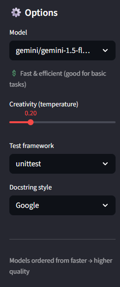
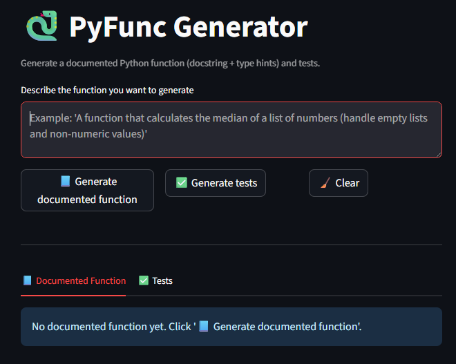

# PyFunc Generator (mini-agent) 🐍

Mini-agent LLM app to generate **Python functions** from natural language.  
It returns:  
1. Documented function (with docstrings + type hints)  
2. Unit tests (**unittest/pytest**)  

**Stack:** Streamlit + LiteLLM (OpenAI)  
**Status:** Deployed ✅ → [Live Demo](https://laurapuerto-pyfunc-generator.streamlit.app/)

---

## ✨ What does this project showcase?

- **Applied LLM app** with a prompt pipeline (function → documentation → tests).  
- Best practices: type hints, PEP8 style, separated tests, secrets management.  
- Simple and usable UI, ideal for portfolio demonstration.  

---

## 🚀 Demo Screenshots

<p align="center">
  
</p>

<p align="center">
  
</p>

---


## 🛠 How to run locally

```bash
# activate venv (already created)
# Windows (PowerShell)
venv\Scripts\activate
# Linux/Mac
source venv/bin/activate

pip install -r requirements.txt

# Add your API key (not pushed to repo)
mkdir -p .streamlit
# create .streamlit/secrets.toml with:
# OPENAI_API_KEY = "your_api_key"

streamlit run app.py
```

---

## 🔑 API Key configuration

- **Local:** create a `.env` file with:

```
OPENAI_API_KEY=your_api_key
```

(this file is ignored by git and not pushed to repo).  

- **Cloud (Streamlit):** configure the key in `Settings → Secrets` (TOML format).  

The code automatically detects if it's running locally or in the cloud.  

---

## 📌 Roadmap

- [x] MVP: pipeline function → doc → tests  
- [x] Selector unittest/pytest  
- [x] File download (.py)  
- [x] Syntax validation (AST) without execution  
- [x] Docstring styles (Google/NumPy)  
- [x] Deploy on Streamlit Cloud + README with screenshots  

---

## 📜 License

MIT
